# Lecture 17 - Backend 4 | Raffle Draw Project

আমরা গত ক্লাসে এক্সপ্রেস, মিডলওয়্যার, কন্ট্রোলার, প্রজেক্ট স্ট্রাকচার সম্পর্কে ভালভাবে আলোচনা করেছিলাম। এই ক্লাসে আমরা একটা প্রজেক্ট করবো। সেটা হচ্ছে র‍্যাফেল ড্র প্রজেক্ট। আমরা শুরু থেকে ধরে ধরে সব অ্যানালাইসিস করে এই প্রজেক্টের ব্যাকএন্ড তৈরি করবো।

এখন যদি আমাদের র‍্যাফেল ড্রয়ের জন্য অ্যাপ্লিকেশন ডিজাইন করতে হয় এতে কি কি ফিচার্স থাকতে পারে একটু দেখি।

- sell lottery ticket
- update lottery ticket
- delete lottery ticket
- get all tickets
- get ticket by id
- bulk buy (user can buy multiple tickets at a time)
- raffle draw

এই অ্যাপ্লিকেশন দিয়ে টিকেট বিক্রয় করার যাবে, টিকেট আপডেট করা যাবে, ডিলিট করা যাবে, সব টিকেট একসাথে পাওয়ার জন্য একটা ফিচার, আইডি অনুসারে টিকেট বের করা, একজন ইউজার একসাথে অনেক টিকেট ক্রয় করতে পারে এমন ফিচার, সবশেষে র‍্যাফেল ড্র।

যেকোনো অ্যাপ্লিকেশন তৈরির পূর্বে আমাদের প্রথম কাজ হলো রিকোয়ারমেন্ট অ্যানালাইসিস। এরপর রিকোয়ারমেন্টসকে এক্সটেন্ড করা। কেন এক্সটেন্ড করবো? কারণ ক্লায়েন্টের বলা সাধারণ ভাষা দিয়ে আমরা অ্যাপ্লিকেশন ডিজাইন করতে পারবো না। আমাদের সেই সাধারণ ভাষাকে টেকনিক্যাল ভাষায় রূপান্তর করতে হবে। এরপর আমাদের কি কি ডাটাবেজ মডেল থাকতে পারে সেগুলো খুঁজে বের করতে হবে। এরপর সেই মডেলগুলোর মধ্যে সম্পর্ক স্থাপন করতে হবে। এখন আমরা অতো জটিলে যাবো না। আমরা প্রথমে আমাদের রিকোয়ারমেন্টগুলো বের করি।

এখানে যদি আমরা লটারী টিকেট বিক্রি করতে চাই তাহলে আমাদের আগে টিকেট স্টরেজ থাকতে হবে একটা। কারণ ড্র করতে হলে আমার টিকেটের ইনফরমেশন লাগবে, সেগুলো যদি আমরা স্টোরই না করি তাহলে কিভাবে ড্র করবো, আর কিভাবেই বা ইউজারের টিকেট ভেরিফাই করবো। সেজন্য আমরা একটা স্টোরেজ সিস্টেম রাখবো। যদি টিকেট স্টোর করা থাকে তাহলে উপরের সব কাজই আমরা করতে পারবো। তার মানে আমাদের অ্যাপ্লিকেশনে একটাই রিকোয়ারমেন্ট, সেটা হলো `Ticket`। এখন এই টিকেটের শেইপ কেমন হতে পারে? শেইপ বলতে টিকেটের মডেলের মধ্যে কি কি থাকতে পারে সেগুলো একটু দেখি।

- number (unique)
- username
- price
- timestamp

প্রথম আমাদের একটা ইউনিক নাম্বার লাগবে টিকেটের। এরপর আমাদের লাগবে যে টিকেট কিনেছে তার নাম। এরপর লাগবে টিকেটের প্রাইস। তারপর টিকেট কখন কিনেছে তার একটা রেকর্ড লাগবে।

এখন এই মডেলকে আমরা কোডের রূপান্তর করতে চাই। তার জন্য আমরা গত ক্লাসের স্ট্রাকচার এবং ফাইল যেভাবে লিখেছিলাম সেগুলো থাকবে। সাথে এখন আমরা models ফোল্ডারের মধ্যে আমরা Ticket.js নামে একটা ফাইল নিয়ে সেখানে একটা ক্লাস তৈরি করবো।

```js
// /models/Ticket.js

const shortid = require('shortid');

class Ticket {
	/**
	 * constructor function
	 * @param {string} username
	 * @param {number} price
	 */
	constructor(username, price) {
		this.id = shortid.generate();
		this.username = username;
		this.price = price;
		this.createdAt = new Date();
		this.updatedAt = new Date();
	}
}

module.exports = Ticket;
```

এই ক্লাসের মধ্যে আমরা কন্সট্রাকটর নিবো। সেখানে প্যারামিটার হিসেবে username, price দিবো। আইডি জেনারেট করার জন্য আমরা shortid নামে একটা প্যাকেজ ইনস্টল করে নিবো। বাকি কোড আপনারা বুঝতে পারছেন। কেন username এবং price আমরা প্যারামিটার হিসেবে নিয়েছি। কারণ এই দুইটা ভ্যারিয়েবলই চেইঞ্জ হবে। ইউজার বিভিন্ন হবে আর প্রাইসও বিভিন্নরকম হতে পারে।

এখন আমরা আমাদের রিকোয়ারমেন্টগুলোর দিকে তাকালে দেখবো আমাদের ডিলিট করার অপশন দরকার। এখন এই ফাইল হচ্ছে সিঙ্গেল টিকেটের। এখান থেকে ডিলিট করতে পারবো না আমরা। আমরা ডিলিট করতে পারবো ডাটাবেজ থেকে যেখানে অনেক টিকেট থাকবে। এই ফাইলে আমরা সর্বোচ্চ আপডেট করতে পারবো।

এবার আমরা ডাটাবেজের কাছে চলে যায়। এখন তো জাস্ট মডেল তৈরি হলো। এই মডেল তো আর একটা থাকবে না অনেকগুলো থাকবে। সেটা আপাতত আমরা ডাটাবেজের মধ্যে ক্রিয়েট করি। আমরা db ফোল্ডারের মধ্যে db.js নামে একটা ফাইল ক্রিয়েট করবো।

```js
// /db/db.js

const Ticket = require('../models/Ticket');

class MyDB {}

const myDB = new MyDB();
module.exports = myDB;
```

আমরা প্রথমে আমাদের মডেলকে ইমপোর্ট করে নিবো। কারণ এটা আমাদের দরকার আছে। এরপর আমরা একটা ক্লাস নিলা। এই ক্লাস আমি এক্সপোর্টও করবো না, মাল্টিপল জায়গায় ব্যবহারও করবো না। করলে কি হবে? আমাদের ইনফরমেশনগুলো ছড়িয়ে ছিটিয়ে যাবে। ইউজার মাল্টিপল ডাটাবেজ ক্রিয়েট করতে পারবে। কিন্তু আমরা চাই আমাদের সমস্ত ইনফরমেশন এক ডাটাবেজে থাকুক। তাই আমরা আমাদের ক্লাসকে একটা অবজেক্টের মধ্যে রেখে সেই অবজেক্টকে এক্সপোর্ট করে দিলাম। জাভাস্ক্রিপ্টের যে মডিউল সিস্টেম তা সিঙ্গেলটোন প্যাটার্ন ফলো করে। এটা আবার কি? সিঙ্গেলটোন প্যাটার্ন মানে হলো কোনো একটা নির্দিষ্ট অবজেক্টকে যেখান থেকেই আপডেট করেন না কেন তা দশ জায়গায় আপডেট হবে না, হবে একটা জায়গাতেই। একেই বলে সিঙ্গেলটোন প্যাটার্ন। এবার আমরা আমাদের ক্লাসের মধ্যে একটা কন্সট্রাকটর নিবো। এখানে আমরা শুধু একটা টিকেটের অ্যারে নিবো। প্রাথমিক অবস্থায় এটা একটা ফাঁকা অ্যারে যার মধ্যে পরবর্তীতে টিকেট রাখবো।

```js
// /db/db.js

const Ticket = require('../models/Ticket');

class MyDB {
	constructor() {
		this.tickets = [];
	}
}

const myDB = new MyDB();
module.exports = myDB;
```

এবার প্রথমে আমরা টিকেট ক্রিয়েট করার জন্য একটা মেথড লিখবো।

```js
// /db/db.js

const Ticket = require('../models/Ticket');

class MyDB {
	constructor() {
		this.tickets = [];
	}

	/**
	 * Create and save a new ticket
	 * @param {string} username
	 * @param {number} price
	 * @returns {Ticket} return a ticket object
	 */
	create(username, price) {
		const ticket = new Ticket(username, price);
		this.tickets.push(ticket);
		return ticket;
	}
}

const myDB = new MyDB();
module.exports = myDB;
```

এখানে আমরা যেভাবে কমেন্ট করেছি সেটা হচ্ছে jsDocs. এটা একটা পাওয়ারফুল টুল। আপনি এটার মাধ্যমে আপনার প্যারামিটারগুলোর টাইপ বলে দিতে পারবেন, যেহেতু জাভাস্ক্রিপ্টে টাইপ বলে দেয়ার কোনো সিস্টেম নাই। এখন create ফাংশনের মধ্যে username, price এই দুইটা প্যারামিটার নিলাম। এরপর একটা টিকেট অবজেক্ট তৈরি করলাম টিকেট মডেল থেকে। সেটা টিকেট অ্যারেতে পুশ করে রিটার্ন করে দিলাম। সিম্পল অনেক।

আমরা এবার একজন ইউজার যেন অনেক টিকেট কিনতে পারে অর্থাৎ বাল্ক টিকেট কেনার একটা মেথড তৈরি করবো। এখানে সব আগের মতো থাকবে শুধু টিকেটের সংখ্যা আসবে। আর যেহেতু একাধিক টিকেট কিনলে টিকেটের আইডি চেইঞ্জ হয় তাই মাল্টিপল টিকেট ক্রিয়েট করতে হবে।

```js
// /db/db.js

const Ticket = require('../models/Ticket');

class MyDB {
	constructor() {
		this.tickets = [];
	}

	/**
	 * Create and save a new ticket
	 * @param {string} username
	 * @param {number} price
	 * @returns {Ticket} return a ticket object
	 */
	create(username, price) {
		const ticket = new Ticket(username, price);
		this.tickets.push(ticket);
		return ticket;
	}

	/**
	 * Create multiple tickets for a single user
	 * @param {string} username
	 * @param {number} price
	 * @param {number} quantity
	 * @returns {Array<Ticket>}
	 */
	bulkCreate(username, price, quantity) {
		const result = [];
		for (let i = 0; i < quantity; i++) {
			const ticket = this.create(username, price);
			result.push(ticket);
		}
		return result;
	}
}

const myDB = new MyDB();
module.exports = myDB;
```

এখানে খুব জটিল কোনো কাজ করা হয়নি। কোয়ানটিটি অনুযায়ী একটা লুপ চালিয়ে টিকেট তৈরি করা হয়েছে এবং সব টিকেট একটা অ্যারে আকারে রিটার্ন করা হয়েছে।

এবার আমরা টিকেট find করার জন্য একটা মেথড বানাবো।

```js
// /db/db.js

const Ticket = require('../models/Ticket');

class MyDB {
	constructor() {
		this.tickets = [];
	}

	/**
	 * Create and save a new ticket
	 * @param {string} username
	 * @param {number} price
	 * @returns {Ticket} return a ticket object
	 */
	create(username, price) {
		const ticket = new Ticket(username, price);
		this.tickets.push(ticket);
		return ticket;
	}

	/**
	 * Create multiple tickets for a single user
	 * @param {string} username
	 * @param {number} price
	 * @param {number} quantity
	 * @returns {Array<Ticket>}
	 */
	bulkCreate(username, price, quantity) {
		const result = [];
		for (let i = 0; i < quantity; i++) {
			const ticket = this.create(username, price);
			result.push(ticket);
		}
		return result;
	}

	/**
	 * returns all available tickets
	 */
	find() {
		return this.tickets;
	}
}

const myDB = new MyDB();
module.exports = myDB;
```

আসলে এখানে কোনো কাজই নেই। find মেথড কল হলে আমরা জাস্ট টিকেটের অ্যারেটা রিটার্ন করে দিবো।

এবার একটা নির্দিষ্ট টিকেটকে কিভাবে আইডি দিয়ে খুঁজে বের করতে পারবো তার একটা মেথড বানাবো।

```js
// /db/db.js

const Ticket = require('../models/Ticket');

class MyDB {
	constructor() {
		this.tickets = [];
	}

	/**
	 * Create and save a new ticket
	 * @param {string} username
	 * @param {number} price
	 * @returns {Ticket} return a ticket object
	 */
	create(username, price) {
		const ticket = new Ticket(username, price);
		this.tickets.push(ticket);
		return ticket;
	}

	/**
	 * Create multiple tickets for a single user
	 * @param {string} username
	 * @param {number} price
	 * @param {number} quantity
	 * @returns {Array<Ticket>}
	 */
	bulkCreate(username, price, quantity) {
		const result = [];
		for (let i = 0; i < quantity; i++) {
			const ticket = this.create(username, price);
			result.push(ticket);
		}
		return result;
	}

	/**
	 * returns all available tickets
	 */
	find() {
		return this.tickets;
	}
}

/**
	 * find ticket by ticket id
	 * @param {string} ticketId
	 * @returns {Ticket}
	 */
	findById(ticketId) {
		const ticket = this.tickets.find(
			/**
			 * @param {Ticket} ticket
			 */
			(ticket) => ticket.id === ticketId
		);

		return ticket;
	}

const myDB = new MyDB();
module.exports = myDB;
```

এখানে আমরা টিকেট অ্যারে থেকে অ্যারের find মেথড ব্যবহার করে নির্দিষ্ট আইডির টিকেট রিটার্ন করবো।

এবার ইউজারনেইম দিয়ে কিভাবে টিকেট বের করতে পারি সেটার একটা মেথড লিখবো।

```js
// /db/db.js

const Ticket = require('../models/Ticket');

class MyDB {
	constructor() {
		this.tickets = [];
	}

	/**
	 * Create and save a new ticket
	 * @param {string} username
	 * @param {number} price
	 * @returns {Ticket} return a ticket object
	 */
	create(username, price) {
		const ticket = new Ticket(username, price);
		this.tickets.push(ticket);
		return ticket;
	}

	/**
	 * Create multiple tickets for a single user
	 * @param {string} username
	 * @param {number} price
	 * @param {number} quantity
	 * @returns {Array<Ticket>}
	 */
	bulkCreate(username, price, quantity) {
		const result = [];
		for (let i = 0; i < quantity; i++) {
			const ticket = this.create(username, price);
			result.push(ticket);
		}
		return result;
	}

	/**
	 * returns all available tickets
	 */
	find() {
		return this.tickets;
	}

	/**
	 * find ticket by ticket id
	 * @param {string} ticketId
	 * @returns {Ticket}
	 */
	findById(ticketId) {
		const ticket = this.tickets.find(
			/**
			 * @param {Ticket} ticket
			 */
			(ticket) => ticket.id === ticketId
		);

		return ticket;
	}

	/**
	 * find all tickets for a given user
	 * @param {string} username
	 * @returns {Array<Ticket>}
	 */
	findByUser(username) {
		const tickets = this.tickets.filter(
			/**
			 * @param {Ticket} ticket
			 */
			(ticket) => ticket.username === username
		);
		return tickets;
	}
}

const myDB = new MyDB();
module.exports = myDB;
```

এখানে ফিল্টার মেথড ইউজ করে একজন ইউজারের সমস্ত টিকেট রিটার্ন করার হয়েছে।

এবার আমরা লিখবো টিকেট আপডেট করার মেথড।

```js
// /db/db.js

const Ticket = require('../models/Ticket');

class MyDB {
	constructor() {
		this.tickets = [];
	}

	/**
	 * Create and save a new ticket
	 * @param {string} username
	 * @param {number} price
	 * @returns {Ticket} return a ticket object
	 */
	create(username, price) {
		const ticket = new Ticket(username, price);
		this.tickets.push(ticket);
		return ticket;
	}

	/**
	 * Create multiple tickets for a single user
	 * @param {string} username
	 * @param {number} price
	 * @param {number} quantity
	 * @returns {Array<Ticket>}
	 */
	bulkCreate(username, price, quantity) {
		const result = [];
		for (let i = 0; i < quantity; i++) {
			const ticket = this.create(username, price);
			result.push(ticket);
		}
		return result;
	}

	/**
	 * returns all available tickets
	 */
	find() {
		return this.tickets;
	}

	/**
	 * find ticket by ticket id
	 * @param {string} ticketId
	 * @returns {Ticket}
	 */
	findById(ticketId) {
		const ticket = this.tickets.find(
			/**
			 * @param {Ticket} ticket
			 */
			(ticket) => ticket.id === ticketId
		);

		return ticket;
	}

	/**
	 * find all tickets for a given user
	 * @param {string} username
	 * @returns {Array<Ticket>}
	 */
	findByUser(username) {
		const tickets = this.tickets.filter(
			/**
			 * @param {Ticket} ticket
			 */
			(ticket) => ticket.username === username
		);
		return tickets;
	}

	/**
	 * update ticket by id
	 * @param {string} ticketId
	 * @param {{username: string, price: number}} ticketBody
	 * @returns {Ticket}
	 */
	updateById(ticketId, ticketBody) {
		const ticket = this.findById(ticketId);
		ticket.username = ticketBody.username ?? ticket.username;
		ticket.price = ticketBody.price ?? ticket.price;
		ticket.updatedAt = new Date();
		return ticket;
	}
}

const myDB = new MyDB();
module.exports = myDB;
```

এখানে প্রথমে আমরা টিকেটের আইডি দিয়ে টিকেটটা বের করে আনলাম। এরপর আমরা ডাটা আপডেট করার কিছু কোড লিখে দিলাম। এখানে ?? কে বলে Nullish Coalescing Operator. এটা মানে বুঝায় যদি ?? এর বাম পাশের ডাটার ভ্যালু null বা undefined হয় তবে তা ?? এর রাইট সাইডের ডাটা ভ্যালু হবে। আর যদি না হয় তাহলে ওটাতে যে ভ্যালু আছে তাই হবে। এখানেও আমরা যদি টিকেট বডিতে কোনো নাম পাই সেটা আপডেট করবো, নাহয় টিকেটের ইউজারনেইম ইউজ করবো।

এবার টিকিট ডিলিট করার মেথড লেখার পালা।

```js
// /db/db.js

const Ticket = require('../models/Ticket');

class MyDB {
	constructor() {
		this.tickets = [];
	}

	/**
	 * Create and save a new ticket
	 * @param {string} username
	 * @param {number} price
	 * @returns {Ticket} return a ticket object
	 */
	create(username, price) {
		const ticket = new Ticket(username, price);
		this.tickets.push(ticket);
		return ticket;
	}

	/**
	 * Create multiple tickets for a single user
	 * @param {string} username
	 * @param {number} price
	 * @param {number} quantity
	 * @returns {Array<Ticket>}
	 */
	bulkCreate(username, price, quantity) {
		const result = [];
		for (let i = 0; i < quantity; i++) {
			const ticket = this.create(username, price);
			result.push(ticket);
		}
		return result;
	}

	/**
	 * returns all available tickets
	 */
	find() {
		return this.tickets;
	}

	/**
	 * find ticket by ticket id
	 * @param {string} ticketId
	 * @returns {Ticket}
	 */
	findById(ticketId) {
		const ticket = this.tickets.find(
			/**
			 * @param {Ticket} ticket
			 */
			(ticket) => ticket.id === ticketId
		);

		return ticket;
	}

	/**
	 * find all tickets for a given user
	 * @param {string} username
	 * @returns {Array<Ticket>}
	 */
	findByUser(username) {
		const tickets = this.tickets.filter(
			/**
			 * @param {Ticket} ticket
			 */
			(ticket) => ticket.username === username
		);
		return tickets;
	}

	/**
	 * update ticket by id
	 * @param {string} ticketId
	 * @param {{username: string, price: number}} ticketBody
	 * @returns {Ticket}
	 */
	updateById(ticketId, ticketBody) {
		const ticket = this.findById(ticketId);
		ticket.username = ticketBody.username ?? ticket.username;
		ticket.price = ticketBody.price ?? ticket.price;
		ticket.updatedAt = new Date();
		return ticket;
	}

	/**
	 * delete ticket from db
	 * @param {string} ticketId
	 */
	deleteById(ticketId) {
		const index = this.tickets.findIndex(
			/**
			 * @param {Ticket} ticket
			 */
			(ticket) => ticket.id === ticketId
		);

		if (index !== -1) {
			this.tickets.splice(index, 1);
			return true;
		} else {
			return false;
		}
	}
}

const myDB = new MyDB();
module.exports = myDB;
```

প্রথমে আমরা চেক করবো যে আইডিটা দেয়া হলো সেটা ইনডেক্স কতো। যদি ইনডেক্স -1 না হয় অর্থাৎ আইডি পাওয়া যায় তবে splice মেথড ব্যবহার করে তা ডিলিট করে দিবো।

এবার সবশেষ ড্র এর জন্য মেথড বানানো বাকি।

```js
// /db/db.js

const Ticket = require('../models/Ticket');

class MyDB {
	constructor() {
		this.tickets = [];
	}

	/**
	 * Create and save a new ticket
	 * @param {string} username
	 * @param {number} price
	 * @returns {Ticket} return a ticket object
	 */
	create(username, price) {
		const ticket = new Ticket(username, price);
		this.tickets.push(ticket);
		return ticket;
	}

	/**
	 * Create multiple tickets for a single user
	 * @param {string} username
	 * @param {number} price
	 * @param {number} quantity
	 * @returns {Array<Ticket>}
	 */
	bulkCreate(username, price, quantity) {
		const result = [];
		for (let i = 0; i < quantity; i++) {
			const ticket = this.create(username, price);
			result.push(ticket);
		}
		return result;
	}

	/**
	 * returns all available tickets
	 */
	find() {
		return this.tickets;
	}

	/**
	 * find ticket by ticket id
	 * @param {string} ticketId
	 * @returns {Ticket}
	 */
	findById(ticketId) {
		const ticket = this.tickets.find(
			/**
			 * @param {Ticket} ticket
			 */
			(ticket) => ticket.id === ticketId
		);

		return ticket;
	}

	/**
	 * find all tickets for a given user
	 * @param {string} username
	 * @returns {Array<Ticket>}
	 */
	findByUser(username) {
		const tickets = this.tickets.filter(
			/**
			 * @param {Ticket} ticket
			 */
			(ticket) => ticket.username === username
		);
		return tickets;
	}

	/**
	 * update ticket by id
	 * @param {string} ticketId
	 * @param {{username: string, price: number}} ticketBody
	 * @returns {Ticket}
	 */
	updateById(ticketId, ticketBody) {
		const ticket = this.findById(ticketId);
		ticket.username = ticketBody.username ?? ticket.username;
		ticket.price = ticketBody.price ?? ticket.price;
		ticket.updatedAt = new Date();
		return ticket;
	}

	/**
	 * delete ticket from db
	 * @param {string} ticketId
	 */
	deleteById(ticketId) {
		const index = this.tickets.findIndex(
			/**
			 * @param {Ticket} ticket
			 */
			(ticket) => ticket.id === ticketId
		);

		if (index !== -1) {
			this.tickets.splice(index, 1);
			return true;
		} else {
			return false;
		}
	}

	/**
	 * find winners
	 * @param {number} winnerCount
	 * @returns {Array<Ticket>}
	 */
	draw(winnerCount) {
		const winnerIndices = new Array(winnerCount);
		let index = 0;
		while (index < winnerCount) {
			let winnerIndex = Math.floor(Math.random() * this.tickets.length);
			if (!winnerIndices.includes(winnerIndex)) {
				winnerIndices[index++] = winnerIndex;
				continue;
			}
		}

		const winners = winnerIndices.map((index) => this.tickets[index]);
		return winners;
	}
}

const myDB = new MyDB();
module.exports = myDB;
```

আমরা প্রথমে আর্গুমেন্ট আকার কতজন উইনার চাইছি তত নাম্বার দিবো। সেই লেংথের একটা অ্যারে বানিয়ে নিলাম। ইনিশিয়ালি ইনডেক্স ধরে নিলাম ০। এবার একটা হোয়াইল লুপ চালাবো যতক্ষণ পর্যন্ত ইনডেক্স winnerCount এর চেয়ে ছোট হবে। সেই লুপে কি থাকবে। প্রথমে টিকেট লেংথের উপর ভিত্তি করে আমরা একটা র‍্যান্ডম ইনডেক্স জেনারেট করবো। এরপর যদি winnerIndices এ এই ইনডেক্স না থাকে তাহলে সেখানে তা দিয়ে দিবো। শেষে আমরা winnerIndices কে ম্যাপ করে সেই ইনডেক্স নাম্বার অনুযায়ী টিকেট ইনফরমেশন বিজয়ী হিসেবে রিটার্ন করবো।

এবার আমরা আমাদের এই ফাংশনগুলো ঠিকঠাক কাজ করছে কিনা সেটা চেক করার জন্য test ফোল্ডারের মধ্যে test.js নামে একটা ফাইল নিয়ে কিছু ডামী ডাটা দিয়ে টেস্ট করে দেখতে পারি।

```js
// /test/test.js

const myDB = require('../db/db');
myDB.create('user 1', 10);
myDB.create('user 2', 10);
myDB.create('user 3', 10);
myDB.create('user 4', 10);
myDB.create('user 5', 10);
const bulk = myDB.bulkCreate('test', 10, 5);
console.log('Bulk', bulk);
const tickets = myDB.find();
console.log('All Tickets', tickets);
const winners = myDB.draw(3);
console.log('Winners', winners);
```

এই ফাইলটা রান করালে আমরা বুঝতে পারবো আমাদের ফাংশন ঠিক আছে কিনা। দেখলাম ঠিক আছে।

এবার আমরা আমাদের অ্যাপ্লিকেশনের রাউটস তৈরি করতে পারি। একটা অ্যাপ্লিকেশনের জন্য রাউটস খুবই গুরুত্বপূর্ণ। কারণ রাউটসের উপর ভিত্তি করে আমাদের অনেক কাজ করতে হয়। তাই আমাদের অ্যাপ্লিকেশনে কয়টা রাউটস থাকতে পারে সেটা আগে বের করে আনতে হবে। আমরা আমাদের ইউজারকে যতগুলো রিসোর্সের এক্সেস দিবো ততটা রাউট তৈরি করতে হবে। ধরেন আমার অ্যাপ্লিকেশনে ৪০টা মডেল আছে। এখন প্রতিটা মডেলের জন্য ৫০০টা করে রাউটস তৈরি করতে হবে। আমাদের সেই ৫০০ \* ৪০ = ২০০০০ টা রাউটস একইভাবে বসে বসে লিখতে হবে। এটাই ব্যাকএন্ডের সমস্যা। কিন্তু কিছু করার নেই। আমাদের এটা করতেই হবে।

এবার আমরা আমাদের রাউটগুলো লিখে ফেলি।

- /tickets/t/:ticketId GET - find single ticket
- /tickets/t/:ticketId PATCH - update ticket by id
- /tickets/t/:ticketId DELETE - delete ticket by id
- /tickets/u/:username GET - find tickets for a given user
- /tickets/sell - create tickets
- /tickets/bulk - bulk sell ticket
- /tickets/draw - find winners
- /tickets/ - find all tickets

এখানে একটা জিনিস খেয়াল রাখতে হবে যেটা আমাদের কমন পাথ /tickets এটা আমাদের সবার নিচে লিখতে হবে। যদি উপরে লিখি তাহলে অনেকসময় অ্যাপ্লিকেশন এরপর কি আছে তা খেয়াল না করে /tickets এর রেজাল্ট রিটার্ন করে দিবে।

এবার আমরা routes ফোল্ডারের মধ্যে এই রাউটগুলো লিখবো।

```js
// /routes/tickets.js

const router = require('express').Router();
const db = require('../db/db');

module.exports = router;
```

এখন `/tickets/t/:ticketId` এর তিনটা মেথড আছে। আমরা চাইলে তিনটা মেথডকে দুইভাবে লিখতে পারি। নিচে দুইটা পদ্ধতিই দেয়া হলো। কিন্তু আমরা প্রথম পদ্ধতি ব্যবহার করবো।

```js
router.get('/t/:ticketId', (req, res) => {});
router.patch('/t/:ticketId', (req, res) => {});
router.delete('/t/:ticketId', (req, res) => {});
```

অথবা

```js
router
	.route('/t/:ticketId')
	.get(() => {})
	.patch(() => {})
	.delete(() => {});
```

এই ফাইলটা আমরা app ফোল্ডারের routes.js এ ব্যবহার করবো।

```js
// /app/routes.js

const router = require('express').Router();

router.use('/api/v1/tickets', require('../routes/ticket'));

router.get('/health', (_req, res) => {
	res.status(200).json({ message: 'Success' });
});

module.exports = router;
```

আপনারা লক্ষ্য করলে দেখবেন tickets.js এ আমরা /tickets না লিখে এর পরবর্তী অংশ থেকে শুরু করেছি। কারণ আমরা আমাদের /app/routes.js এ আর্গুমেন্ট আকারে '/api/v1/tickets' এই পাথটা দিয়ে রেখেছি। তাই আমরা tickets.js এ এর পরবর্তী অংশ থেকে লিখতে পারবো।

এবার আমাদের রাউটসগুলো একে একে সিরিয়ালি যেভাবে লিখেছিলাম সেভাবে কোড করি।

```js
// /routes/tickets.js

const router = require('express').Router();
const db = require('../db/db');

router.get('/t/:ticketId', (req, res) => {
	const ticketId = req.params.ticketId;
	const ticket = db.findById(ticketId);
	res.status(200).json(ticket);
});

module.exports = router;
```

এখানে আমরা params থেকে টিকেটের আইডি পাবো। এরপর আমাদের ডাটাবেজ থেকে সেই আইডি দিয়ে টিকেটটা বের করে আনবো json আকারে।

এভাবে বাকিসব লিখে ফেলি।

```js
// /routes/tickets.js

const router = require('express').Router();
const db = require('../db/db');

router.get('/t/:ticketId', (req, res) => {
	const ticketId = req.params.ticketId;
	const ticket = db.findById(ticketId);
	res.status(200).json(ticket);
});

router.patch('/t/:ticketId', (req, res) => {
	const ticketId = req.params.ticketId;
	const updatedTicket = db.updateById(ticketId, req.body);
	console.log(updatedTicket);
	res.status(200).json({ message: 'Updated Successfully', updatedTicket });
});

router.delete('/t/:ticketId', (req, res) => {
	const ticketId = req.params.ticketId;
	db.deleteById(ticketId);
	res.status(203).send();
});

router.get('/u/:username', (req, res) => {
	const username = req.params.username;
	const tickets = db.findByUser(username);
	res.status(200).json(tickets);
});

router.post('/sell', (req, res) => {
	const { username, price } = req.body;
	const ticket = db.create(username, price);
	res.status(201).json({ message: 'Ticket created successfully', ticket });
});
router.post('/bulk', (req, res) => {
	const { username, price, quantity } = req.body;
	const tickets = db.bulkCreate(username, price, quantity);
	res
		.status(201)
		.json({ message: 'Bulk ticket created successfully', tickets });
});
router.get('/draw', (req, res) => {
	const winnerCount = req.query.wc ?? 3;
	const winners = db.draw(winnerCount);
	res.status(200).json(winners);
});
router.get('', (req, res) => {
	const tickets = db.find();
	res.status(200).json(tickets);
});

module.exports = router;
```

এবার আমরা আমাদের অ্যাপ্লিকেশনকে পোস্টম্যানে টেস্ট করে দেখবো। পোস্টম্যানের বিকল্প হিসেবে vs code এ এক্সটেনশন হিসেবে thunder client আছে। আমি এখানে thunder client ব্যবহার করছি।

প্রথমে আমরা আমাদের /health রাউট টেস্ট করবো।

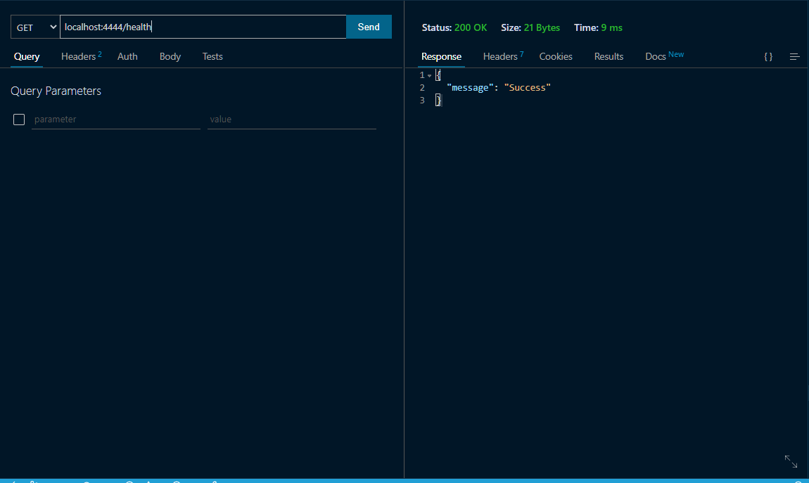

এবার আমরা /api/v1/tickets এ হিট করলে দেখবো একটা ফাঁকা অ্যারে দেখাচ্ছে। খুবই স্বাভাবিক কারণ আমরা এখনও কিছু ক্রিয়েট করিনি।

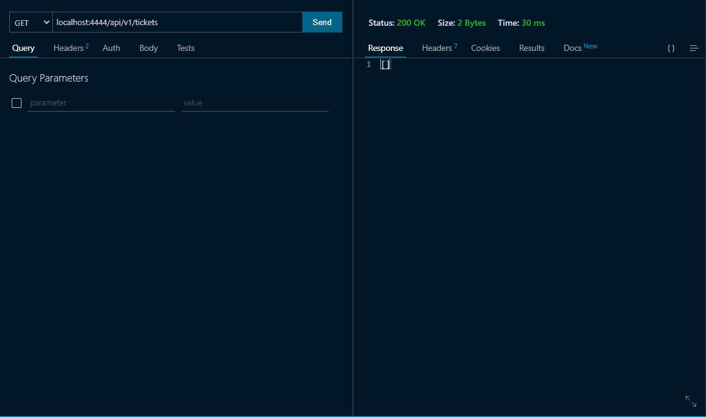

এবার আমরা টিকেট ক্রিয়েট করবো। /api/v1/tickets/sell এর মাধ্যমে।

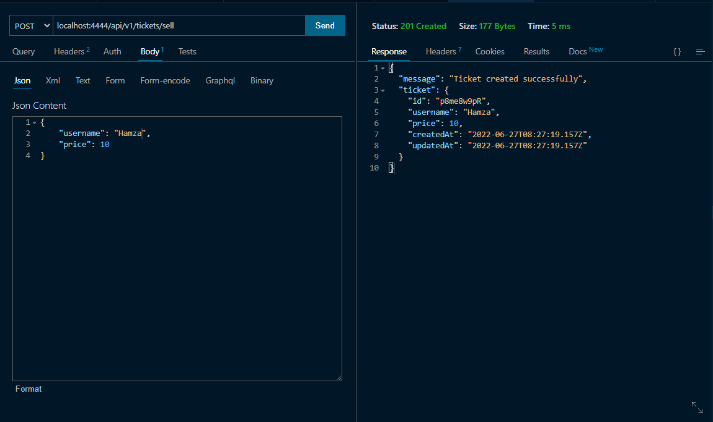

টিকেট ক্রিয়েট হয়ে গেছে। এবার আরো কয়েকটা করি।

এবার যদি আমরা আমাদের /api/v1/tickets এ হিট করি দেখবো আমাদের ফাঁকা অ্যারে ভরে গেছে টিকেটে।

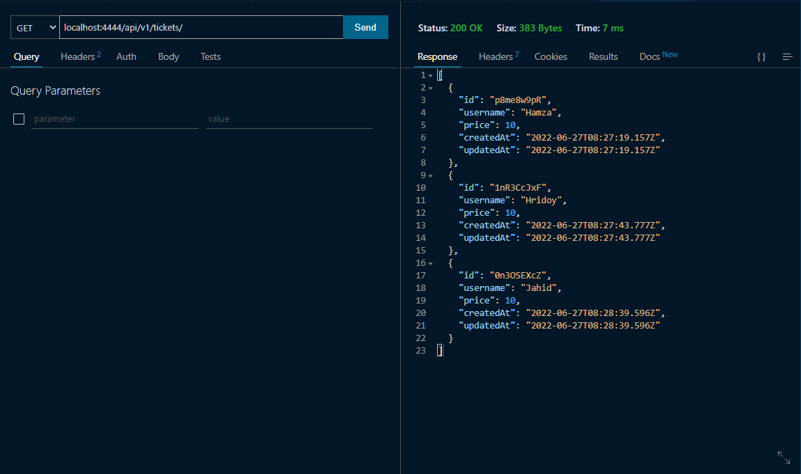

এবার bulk টেস্ট করার পালা।

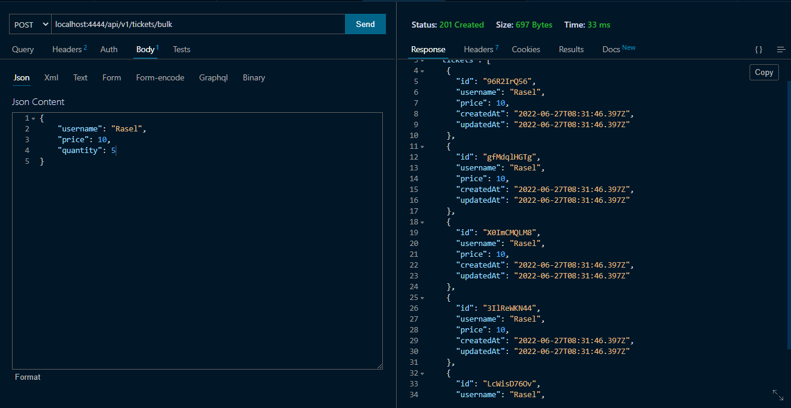

আমাদের টিকেটের মধ্যেও এগুলো চলে এসেছে।

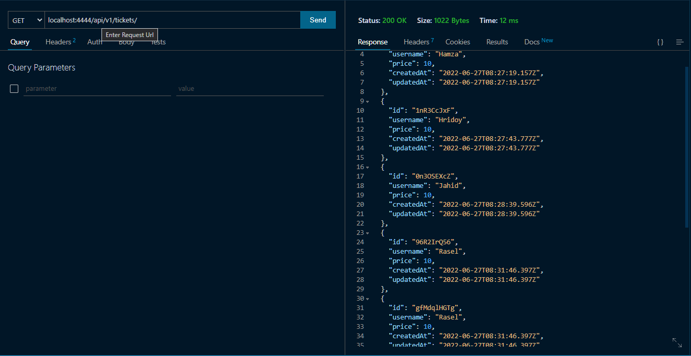

আমরা বাল্কে আরো একটা ডাটা পুট করলাম ১০টা টিকেটের।

এবার একটু draw ট্রাই করা যাক। দেখি কে উইনার। আমরা কয়জন উইনার চাই তা কুয়েরি স্ট্রিং আকারে দিয়ে দিবো। আর না দিলে বাই ডিফল্ট তিনজন উইনার রিটার্ন করবে। প্রথমে আমরা কিছু না দিয়ে দেখি।


এবার আমরা চাই একজন উইনার।

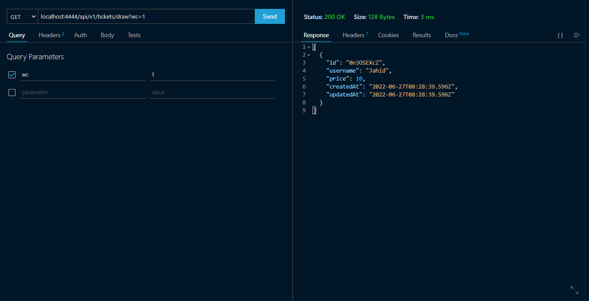

এটাও কাজ করছে।

এবার আমরা আইডি দিয়ে টিকেট খুঁজে বের করি।

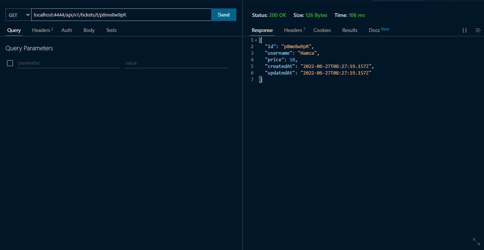

এবার এটাকে আপডেট করবো।

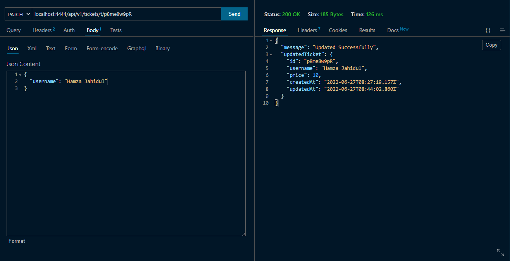

টিকেট অ্যারেতে গেলে দেখা যাবে সেখানেও আপডেট হয়ে গেছে।

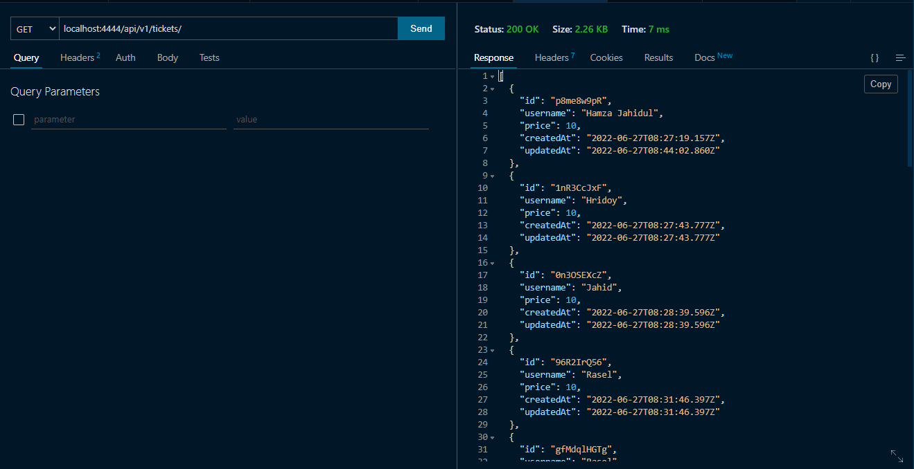

আমরা এবার ডিলিট অপারেশন চালাবো। আমরা Hridoy নামের ইউজারকে ডিলিট করবো। প্রথমে তার আইডি নিতে হবে।

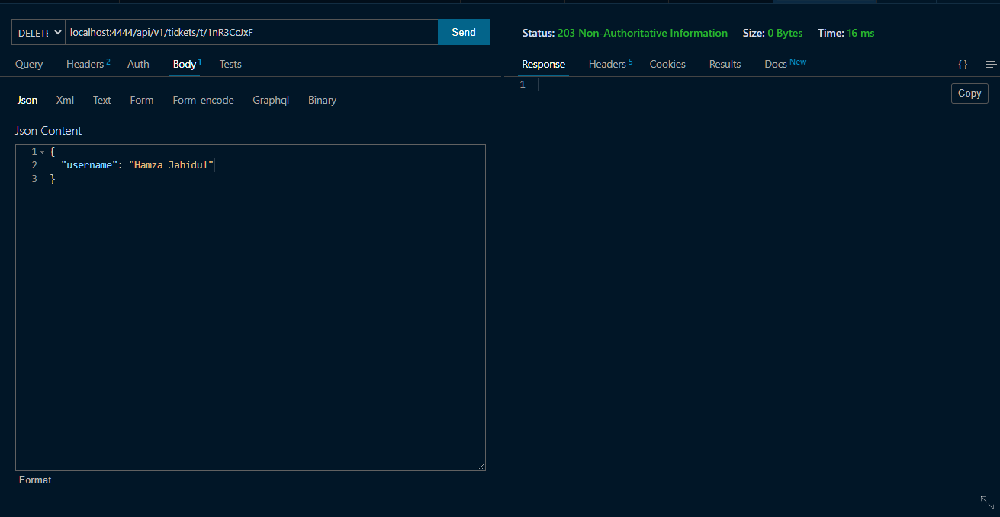
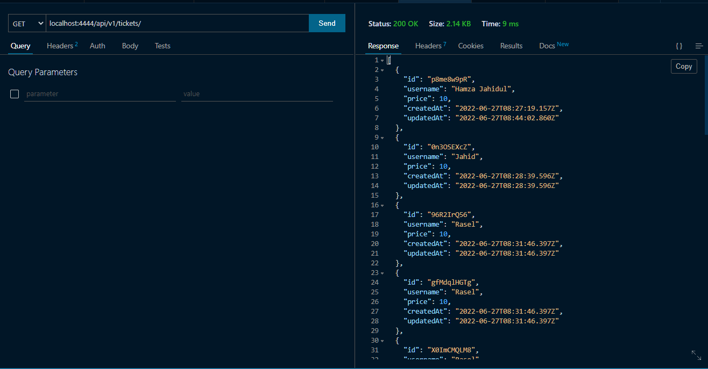

দেখা যাচ্ছে সেই আইডিটা আর নেই অ্যারেতে।

এবার সর্বশেষ আমরা দেখবো ইউজার নেইম দিয়ে কিভাবে টিকেট পাবো।

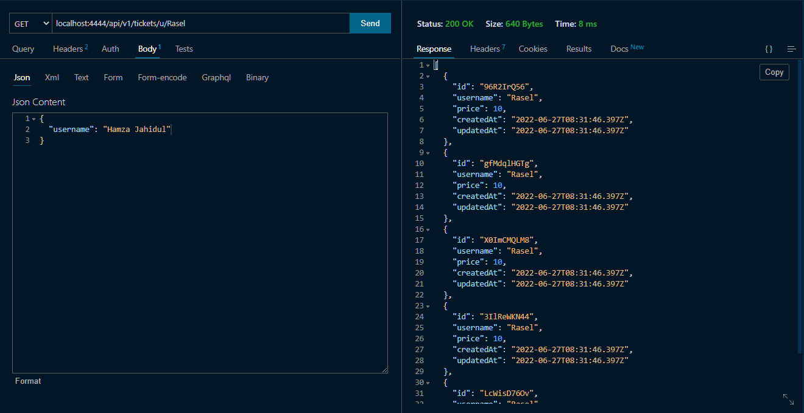

এটাও সাক্সেসফুল। তার মানে আমাদের অ্যাপ্লিকেশন কমপ্লিট।

এরপরের ক্লাসে ডাটাবেইজ নিয়ে আলোচনা হবে। তার জন্য আপনাদের একটা টাস্ক করে আসতে হবে। আপনারা [mongodb docs](https://www.mongodb.com/docs/manual/crud/) এ গিয়ে Insert documents, Query documents, Update documents and Delete documents এগুলো স্টাডি করবেন হাতে কলমে।

## Resource for this lecture

এই লেকচারের সমস্ত রিসোর্স [লেকচার ১৭](../../resources/lecture-17/README.md) এ পাবেন।

## Source Code

এই লেকচারের সোর্স কোডসমূহ এই [লিংক](../../src/raffle-draw/) এ পাবেন।

## AUTHOR

[Aditya Chakraborty](https://github.com/adityackr)
