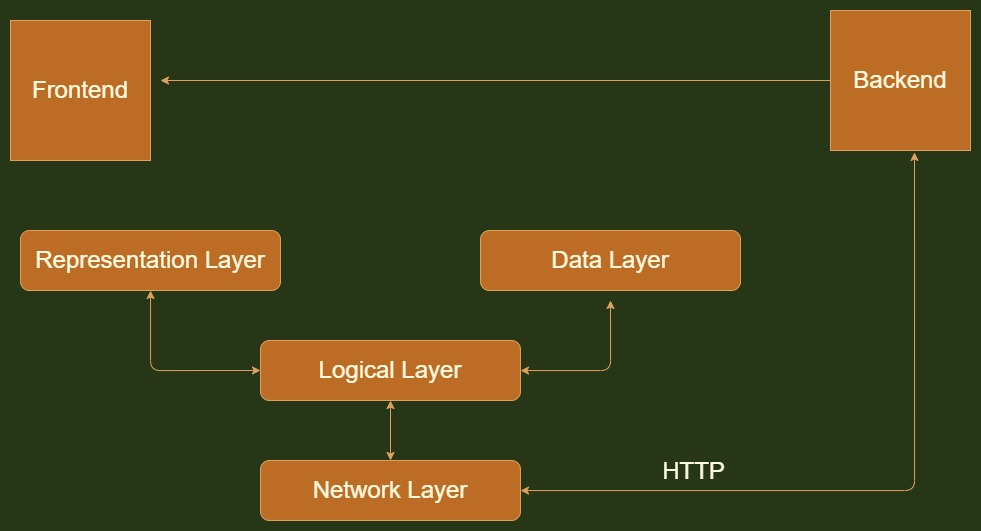
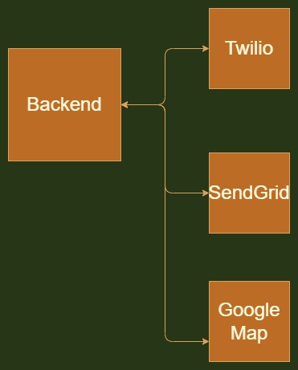
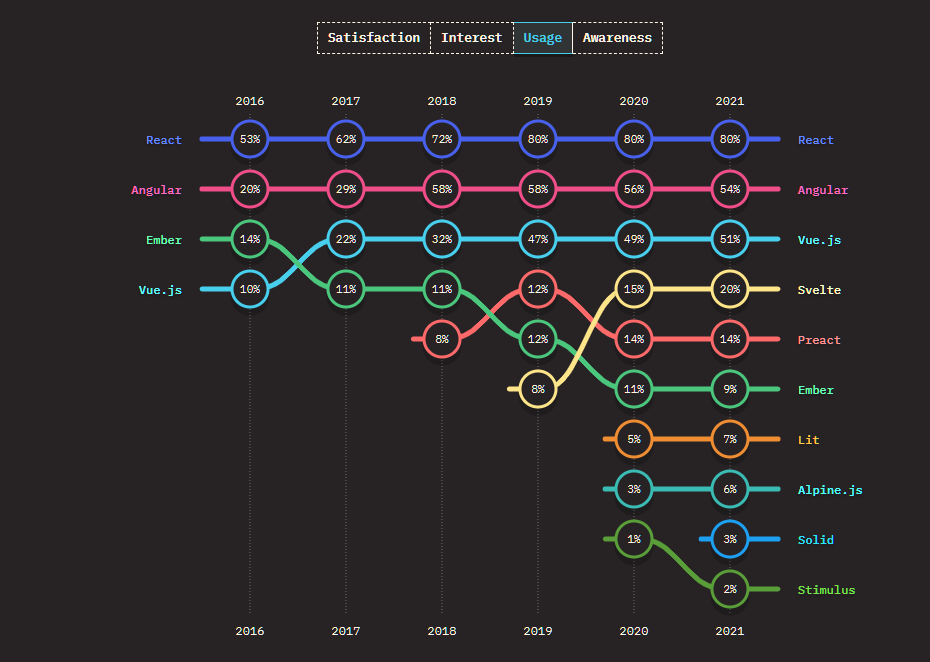
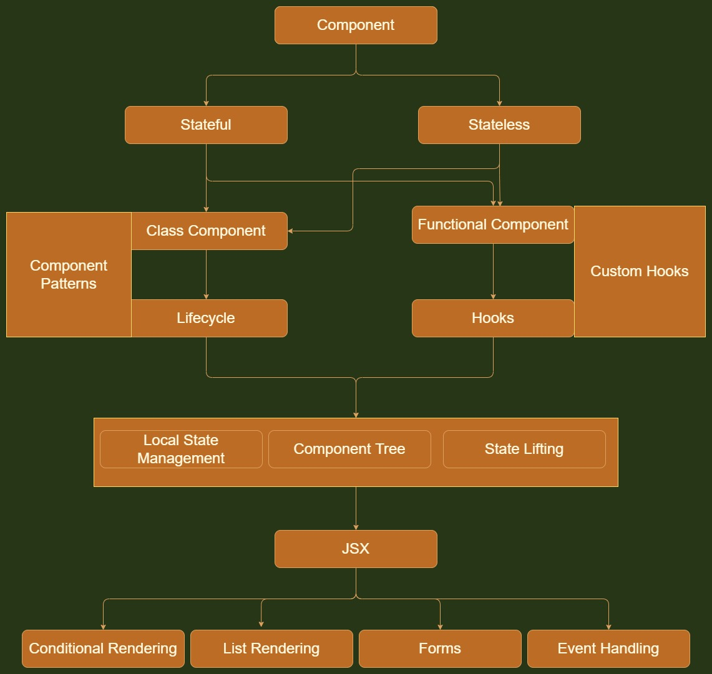
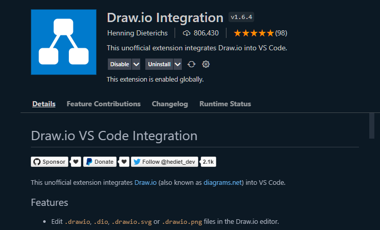

# Lecture 27 - Frontend Core Concepts and Communication

## Table of contents

- [What is Frontend](#what-is-frontend)
- [Features of Frontend](#features-of-frontend)
- [Why Frameworks](#why-frameworks)
- [Core Features of ReactJS](#core-features-of-reactjs)

## What is Frontend

গত ক্লাস পর্যন্ত আমরা আমাদের অ্যাপ্লিকেশনের ব্যাকএন্ড বা মন প্রাণ তৈরি করেছি। এই ক্লাস থেকে আমরা আমাদের অ্যাপ্লিকেশনের শারীরিক বা বাহ্যিক রূপ কিভাবে দেয়া যায় সেটা দেখবো। এই ক্লাসে ফ্রন্টএন্ড সম্পর্কে একটা বৃহৎ ধারণা দেয়া হবে। যে ধারণাটা পেলে আশা করি আপনাদের ডেস্কটপ, ওয়েব, মোবাইল কোনো প্ল্যাটফর্মের ডেভেলপমেন্ট নিয়ে ভাবতে হবে না। সব একই।

আমরা এতদিন পর্যন্ত যা বানিয়েছি সেটা হলো API। এই API নিয়েও অনেকে বিজনেস করছে। উদাহরণস্বরূপ বলা যায় [Twilio](https://www.twilio.com/) এর কথা। এরা SMS, Voice, Video এবং Authentication এর API দিয়ে বিজনেস করছে।

কিন্তু আমরা ফুলস্ট্যাক ডেভেলপার হতে চাইছি। তাই আমাদের শুধু API নিয়ে সন্তুষ্ট থাকলে চলবে না। আমাদের ফ্রন্টএন্ড নিয়েও ভাল ধারণা থাকতে হবে।

আমাদের প্রথমে ক্লায়েন্টের সংজ্ঞা বুঝতে হবে। ক্লায়েন্ট অনেক ধরণের হতে পারে। আমাদের বুঝতে হবে কে কে আমাদের ক্লায়েন্ট। ডেভেলপমেন্ট জগতে ক্লায়েন্ট হলো মূলত ব্রাউজার, ডেস্কটপ, মোবাইল এসব। যারা আমাদের API ব্যবহার করবে। আমাদের ক্লায়েন্ট বলতে মনে আসে যারা আমাদের কাজ দিবে বা যারা ইউজার তারা ক্লায়েন্ট। কিন্তু খেয়াল করলে দেখা যাবে ইউজার আমাদের এপিআই কিন্তু ব্যবহার করবে না। ধরেন আপনি ইউজার। আপনি ফেসবুকে ঢুকলেন। ঢুকে যদি ইনস্পেক্টে গিয়ে নেটওয়ার্ক ট্যাবে যান এবং সেখানে fetch/xhr রিকোয়েস্টের দিকে তাকান তাহলে দেখবেন আপনি কোনো লাইক, কমেন্ট বা কিছু করলে ওখানে কিছু xhr রিকোয়েস্ট যাবে। সেগুলোতে ক্লিক করলে JSON আকারে API দেখতে পারবেন। এখন আপনি তো এই এপিআই ব্যবহার করছেন না। আপনি করছেন ফেসবুকে ফ্রন্টএন্ড ব্রাউজার বা মোবাইল অ্যাপের মাধ্যমে। সেই ব্রাউজার বা মোবাইল অ্যাপ ঐ এপিআই ব্যবহার করছে। তাহলে আপনি বা ইউজার কখনই ক্লায়েন্ট না, ক্লায়েন্ট হলো তারাই যারা এপিআই সরাসরি ইউজ করছে।

আমরা একটু আমাদের ক্লায়েন্ট কি কি হতে পারে সেটা লিস্ট করি।

1. Web App: আমরা ব্রাউজারের মাধ্যমে অ্যাপ ব্যবহার করলেও আমাদের ব্যাকএন্ডের একচুয়েল ক্লায়েন্ট হলো এর Web অ্যাপ। আমাদের Web অ্যাপই ব্যাকএন্ডের এপিআই ব্যবহার করছে সরাসরি।
2. Mobile App: আমরা ব্রাউজারে ফেসবুকের ওয়েব অ্যাপ্লিকেশনে একটা পোস্ট দিলে তার নোটিফিকেশন আমাদের মোবাইল অ্যাপেও চলে আসে। কিন্তু আমি তো দিয়েছি ওয়েব অ্যাপ্লিকেশনে, মোবাইলে কেন নোটিফিকেশন আসবে? তার মানে ওয়েব, ডেস্কটপ, মোবাইল অ্যাপ্লিকেশন একটা নির্দিষ্ট কিছুর সাথে কানেক্টেড, সেটা হলো এপিআই। তাই মোবাইল অ্যাপও আমাদের ব্যাকএন্ডের ক্লায়েন্ট।
3. Desktop App
4. IoT Device: IoT (Internet of Things) ডিভাইস হলো এমন কিছু ছোট ছোট ননস্ট্যান্ডার্ড কম্পিউটিং ডিভাইস, যারা ওয়্যারলেসের মাধ্যমে ইন্টারনেটের সাথে কানেক্টেড থাকে এবং ডাটা পাঠানোর ক্ষমতা রাখে। যেমন স্মার্ট টিভি। স্মার্ট টিভিতে আমরা ইন্টারনেটের মাধ্যমে ইউটিউব, ফেসবুক, নেটফ্লিক্স এসব চালাতে পারি। ধরেন আমাদের একটা IoT ডিভাইস আছে যেটা শুধু দরজা খুললে আর বন্ধ করলে এই ইনফরমেশন সার্ভারের কাছে ডাটা পাস করবে। যেহেতু এই ডিভাইস ব্যাকএন্ড অ্যাপ্লিকেশনের এপিআই ব্যবহার করছে তাই IoT ডিভাইস আমাদের ক্লায়েন্ট।

সহজ কথায় যেকোনো অ্যাপ্লিকেশন বা ডিভাইস যে আমাদের ব্যাকএন্ডের এপিআই ব্যবহার করছে, তাকেই আমরা আমাদের ব্যাকএন্ডের ক্লায়েন্ট বলে গণ্য করতে পারি। তাহলে এই থিওরি অনুসারে আমাদের ডাটাবেজের ক্লায়েন্ট হলো ব্যাকএন্ড। কারণ আমাদের ডাটাবেজ সরাসরি ব্যবহার করে ব্যাকএন্ড।

এখন সবাই কিভাবে ব্যাকএন্ডের সাথে কানেক্ট হচ্ছে। সেই মাধ্যম হলো এপিআই। কারণ সে সবাইকে JSON আকারে ডাটা প্রোভাইড করছে। ডাটাবেজে কিভাবে ডাটা সেইভ হচ্ছে সেটা ফ্রন্টএন্ডের ব্যাপার না। ফ্রন্টএন্ড সবসময় ব্যাকএন্ড থেকে JSON ব্যবহার করছে। যেহেতু ব্যাকএন্ড সবাইকেই একই JSON দিচ্ছে সুতরাং যে এই JSON বুঝতে পারে, সেই এর ক্লায়েন্ট হওয়ার যোগ্যতা রাখে।

আরেকটু ভালভাবে বুঝার চেষ্টা করি। ধরেন একজন দোকানদার চাল বিক্রি করে। এখন সবাই ঐ দোকানে যায় চাল কিনতে, কেউ ৫ কেজি কিনে, কেউ ২৫ কেজির বস্তা কিনে, কেউ ৫০ কেজির বস্তা কিনে। কিন্তু আল্টিমেটলি সবাই চালই কিনে। তাহলে দোকানদারকে যদি আমরা ব্যাকএন্ড এপিআই ধরি তাহলে তার ক্লায়েন্ট যারা চাল কিনে সবাই। কেনার ওয়ে ভিন্ন হতে পারে, পরিমাণ ভিন্ন হতে পারে কিন্তু চালই কিনছে সবাই।

এবার আমরা যে কফিশপের অ্যাপ্লিকেশনের প্ল্যানিং করেছিলাম সেটা ধরি। এর ব্যাকএন্ডে আমরা রেস্ট এপিআই বানালাম। এবার যারা প্রোগ্রামার তাদের বেশিরভাগ সময় কাটে ভিএস কোডে। আমরা চাইলে ভিএস কোডে একটা এক্সটেনশন বানিয়ে ফেললাম। সেই এক্সটেনশন থেকে অর্ডার করা যাবে। সেই এক্সটেনশন বানানোর প্রসেস ভিন্ন হতে পারে, কিন্তু আমরা ঐ ব্যাকএন্ডের এপিআই ব্যবহার করবো। সুতরাং ভিএস কোড এক্সটেনশন আমার ব্যাকএন্ডের ক্লায়েন্ট। এবার যাদের বেশির ভাগ সময় কাটে ব্রাউজারে তাদের জন্য আমরা ক্রোমিয়াম এক্সটেনশন বানিয়ে ফেললাম। যেহেতু এখন ম্যাক্সিমাম ব্রাউজার ক্রোমিয়াম ব্যবহার করে তাই ক্রোমিয়াম এক্সটেনশন বানালে তা সব ব্রাউজার সাপোর্ট করবে। এখন এই এক্সটেনশন বানানোর সিস্টেম আলাদা। কিন্তু এটা ব্যবহার করবে আমাদের সেই একই এপিআই। ব্যাকএন্ড কিন্তু একটাই। তাহলে এই ক্রোমিয়াম এক্সটেনশনও আমাদের ব্যাকএন্ডের ক্লায়েন্ট। আবার যারা ডিজাইনার তারা কাজ করেন ফিগমাতে। ফিগমা প্লাগিনও বানাতে পারি আমরা এই সেইম এপিআই ব্যবহার করে। আসল কথা হচ্ছে আমার ক্লায়েন্ট অনেক অনেক হতে পারে। কিন্তু সবার ব্যাকএন্ড একটাই। ব্যাকএন্ড কিন্তু আমরা চেইঞ্জ করছি না। আমরা এক এক উপায়ে এক এক ক্লায়েন্টের কাজ করছি। কিন্তু ব্যাকএন্ড সেই একটাই। তার মানে আমরা একটা অ্যাপ্লিকেশনের ওয়েব, মোবাল, ডেস্কটপ, এক্সটেনশন, প্লাগিন যাই বানাই না কেন আমাদের ব্যাকএন্ড কিন্তু একটাই। ঐ ব্যাকএন্ডের মাধ্যমেই আমাদের সমস্ত ভার্সন কানেক্টেড থাকে।

এখন প্রশ্ন উঠতে পারে আমাদের তো শুধু ওয়েব অ্যাপ ডেভেলপমেন্ট শিখলেই হচ্ছে এতকিছু জানার প্রয়োজন কি? আমরা যা যা বললাম, IoT ডিভাইস ছাড়া বাকি সবগুলোতেই কিন্তু ইউজার কিছু না কিছু ইন্টেরেকশন করছে অ্যাপ্লিকেশনের মাধ্যমে। এই সবগুলোই কিন্তু ফ্রন্টএন্ডের অন্তর্ভুক্ত। যেখানে যেখানে UI এবং ইউজার ইন্টেরেকশনের ব্যাপার আছে সেগুলো সবগুলোই ফ্রন্টএন্ডের অন্তর্ভুক্ত। শুধু তা বানানোর সিস্টেমটা এক একটার ক্ষেত্রে একেকরকম। কিন্তু ফ্রন্টএন্ডের মূল কনসেপ্ট এক। কনসেপ্ট যদি আমাদের জানা থাকে তাহলে আমরা যেকোনো কিছুর জন্য অ্যাপ্লিকেশন বানাতে পারবো।

## Features of Frontend

এখন আমরা বুঝলাম ফ্রন্টএন্ড কি। এখন এই ফ্রন্টএন্ডের মধ্যে থাকে কি? চলুন সেগুলো আলোচনা করি।

- Representation Layer: এটা বলতে বুঝায় আমাদের অ্যাপ্লিকেশন ওপেন করলে যা আমাদের চোখের সামনে আসে। সেটা একটা বাটন বা ফর্ম বা প্যারাগ্রাফ, হেডিং, ইমেজ ইত্যাদি যাই হোক না কেন। অ্যাপ্লিকেশনের ইউজার ইন্টারফেইসকেই আমরা বলি রিপ্রেজেন্টেশন লেয়ার। HTML, CSS দিয়ে আমরা এই লেয়ারটা তৈরি করি।
- Data Layer: দুই ধরণের ডাটা আছে - অ্যাপ্লিকেশন ডাটা ও সার্ভার ডাটা। আমরা ধরেন কোনো স্ক্রিনকে ফুলস্ক্রিন করবো একটা জায়গায় ক্লিক করে, বা ভিএস কোডে আমাদের যে সাইড বার আছে সেটাকে আমরা Toggle করতে পারি এসব অ্যাপ্লিকেশন রিলেটেড ডাটা। এই ডাটাগুলো সার্ভারে রাখার কোনো প্রয়োজন নেই। এগুলো আমরা আমাদের ফ্রন্টএন্ডে রাখতে পারি। আর সার্ভার ডাটা হলো যেগুলো আমরা এপিআই থেকে পাবো, যেগুলো আমাদের ডাটাবেজে স্টোর হয়ে থাকে। এখন ডাটাগুলো কোনো না কোনো উপায়ে আমাদের অ্যাপ্লিকেশনে প্রসেস করার বা ম্যানেজ করার বিষয় আছে। এগুলো করার জন্য এই ডাটা লেয়ারের প্রয়োজন।
- Logical Layer: আমরা ডাটা লেয়ার থেকে ডাটা নিয়ে কিছু লজিকের মাধ্যমে প্রসেস করে সেটা রিপ্রেজেন্টেশন লেয়ারে পাঠাবো। আবার এর উল্টোও হতে পারে। রিপ্রেজেন্টেশন লেয়ার থেকে ডাটা নিয়ে তা প্রসেস করে আবার ডাটা লেয়ারে পাঠাতে পারি। এই প্রসেসটা যেখানে হয় সেটা লজিক্যাল লেয়ার।
- Network Layer: নেটওয়ার্ক লেয়ারের কাজ হলো লজিক্যাল লেয়ারের সাথে সম্পৃক্ত থেকে যে ডাটাগুলো সার্ভারের সাথে কমিউনিকেশন দরকার সেই কমিউনিকেশন রক্ষা করা। এই একটা মাত্র লেয়ার যে লেয়ারের মাধ্যমে আমরা ব্যাকএন্ড এবং ফ্রন্টএন্ডকে যুক্ত করবো।

এগুলোই মূলত আমাদের ফ্রন্টএন্ডের লেয়ার। মূলত চার ধরণের লেয়ার। রিপ্রেজেন্টেশন লেয়ার আমরা এইচটএমএল, সিএসএস দিয়ে তৈরি করবো। লোকাল স্টোরেজ, বা ছোট ছোট কিছু ডাটাবেজ নিয়ে আমরা ডাটা লেয়ারে কাজ করতে পারি। নেটওয়ার্ক নিয়ে কাজ করার জন্য আছে নেটওয়ার্ক লেয়ার। আর সবগুলোকে সমন্বয় করার জন্য আছে লজিক্যাল লেয়ার। আমরা একটা গ্রাফিক্যাল রিপ্রেজেন্টেশনের মাধ্যমে এটা দেখানোর চেষ্টা করলাম।

আমরা ব্যাকএন্ড এপিআই থেকে নেটওয়ার্ক লেয়ারের মাধ্যমে ডাটা নিয়ে সেটা লজিক্যাল লেয়ারের মাধ্যমে সুন্দরভাবে প্রসেস করে তা ডাটা লেয়ারে জমা রাখবো যেন প্রয়োজনে সেই ডাটা আমরা রিপ্রেজেন্টেশন লেয়ারে শো করতে পারি। আবার রিপ্রেজেন্টেশন লেয়ার থেকে প্রাপ্ত ডাটা লজিক্যাল লেয়ারের মাধ্যমে প্রসেস করে নেটওয়ার্ক লেয়ারের মাধ্যমে ব্যাকএন্ডে স্টোর করে রাখতে পারি আবার ব্যাকএন্ড থেকে ডাটা নিয়ে আসতে পারি। নেটওয়ার্ক লেয়ার আর ব্যাকএন্ড এপিআই এর মধ্যে কমিউনিকেশন হয় HTTP দ্বারা। এটাই হচ্ছে মূল কনসেপ্ট।

এই কনসেপ্ট যত ফ্রন্টএন্ড অ্যাপ্লিকেশ আছে সবকিছুর জন্য সেইম। আমরা এই কনসেপ্ট দিয়ে যেকোনো ফ্রন্টএন্ড অ্যাপ বানাতে পারবো। এখানে পার্থক্য বলতে শুধু একেক অ্যাপ্লিকেশনের জন্য ল্যাঙ্গুয়েজ, ফ্রেমওয়ার্ক এগুলো। যেমন যদি আমরা রিয়্যাক্টে কাজ করি তাহলে আমরা লিখবো jsx, যদি ভিউ বা অ্যাঙ্গুলারে কাজ করি তাহলে টেমপ্লেট ইঞ্জিন ব্যবহার করবো, যদি জাভা কটলিন দিয়ে মোবাইল অ্যাপ ডেভেলপ করি সেখানে আমাদের লিখতে হবে xml। কিন্তু দিনশেষে আমরা ঐ রিপ্রেজেন্টেশন লেয়ারই তৈরি করছি। তাই ইমপ্লিমেন্ট ভিন্ন হলেও আমাদের কনসেপ্ট সবকিছুর জন্য একই।

একটা সময় একই ব্যাকএন্ড ইউজ করে সব ফ্রন্টএন্ড করা যেতো না। কারণ তখন ব্যাকএন্ডে একটা রিকোয়েস্ট আসলে সেটা ঐ ডাটাসহ একটা পেইজের HTML তৈরি করে ব্যাক করতো। এখন একটা বিশাল এইচটিএমএল ফাইল থেকে মোবাইল অ্যাপের মতো করে ডাটা বের করে আনা অনেক কষ্টসাধ্য ছিল। সে সমস্যার সমাধান করেছে JSON। এখন ব্যাকএন্ড এপিআই আমাদের শুধু raw data দিয়ে দিচ্ছে। আমরা আমাদের মতো করে সেই ডাটা ইউজ করে ফ্রন্টএন্ড অ্যাপ্লিকেশন বানাতে পারছি।

আরেকটা বাস্তব উদাহরণ দিয়ে আমরা এটা বুঝার চেষ্টা করি। আগে কম্পিউটার কোম্পানিগুলো ডেস্কটপ বানিয়ে রাখতো। অর্থাৎ তারা আগে থেকে কনফিগার করে রাখতো সব। আমরা গিয়ে জাস্ট কিনে নিয়ে চলে আসতাম। ঐ যে পুরো এইচটিএমএল ফাইলের মতো। আমাদের আলাদাভাবে কনফিগার করা সম্ভব হতো না। এখন আমরা চাইলে একটা ডেস্কটপের মধ্যে বিভিন্ন কোম্পানির কম্পোনেন্ট ইউজ করতে পারি। আমরা আমাদের মতো করে হার্ডডিস্ক, র‍্যাম, গ্রাফিক্স কার্ড, মাদারবোর্ড সব কনফিগার করতে পারি। রেস্ট এপিআই বর্তমানে এই সুবিধাটাই দিচ্ছে। আমাদের যা লাগবে আমরা শুধু সেই ডাটা নিয়েই কাজ করতে পারবো।

এত এত কথাকে এবার সংক্ষিপ্ত করে এক কথা দিয়ে বুঝিয়ে দিই। ধরেন আপনি কোথাও আপনার অ্যাপ্লিকেশনটা ওপেন করলেন। সেটা মোবাইল, ব্রাউজার যেটাই হোক। করার পরে আপনি কিছু সার্চ করতে চাইছেন। যেখানে আপনি আপনার সার্চ করার জন্য লিখবেন সেটা হচ্ছে **রিপ্রেজেন্টেশন লেয়ার**। এবার সেই সার্চ করা ডাটা খুঁজে নিয়ে আসতে হবে সার্ভার থেকে। সার্ভারের সাথে সেই কমিউনিকেশনের দায়িত্ব পালন করবে **নেটওয়ার্ক লেয়ার**। এবার আমার ডাটাটা একটু ফরম্যাটিং এর প্রয়োজন হতে পারে। সেটা করবে **লজিক্যাল লেয়ার**। এরপর সেটা ক্লায়েন্টের একটা জায়গায় স্টোর করে রাখতে হবে। সেই কাজটার জন্য আছে **ডাটা লেয়ার**। এবার ডাটা লেয়ার লজিক্যাল লেয়ারের মাধ্যমে আমাদের সার্চ করা ডাটা সুন্দরভাবে যেভাবে শো করানো দরকার সেভাবে রিপ্রেজেন্টেশন লেয়ার পাঠিয়ে দেবে এবং রিপ্রেজেন্টেশন লেয়ার সেই ডাটা আমাদেরকে শো করবে।

এতটুকু যদি আপনারা বুঝতে পারেন তাহলে ফ্রন্টএন্ড ডেভেলপমেন্টের একটা বড় অংশ আপনারা বুঝে ফেলেছেন। যখন ফ্রেমওয়ার্কে কাজ করবো আমরা তখন অনেক মজা পাবেন কাজ করতে যদি এই কনসেপ্ট বুঝে থাকেন।

আরেকটা জিনিস একটু বুঝা দরকার। এই পুরো প্রসেসে মেইন রোল প্লে করে HTTP। এটা না থাকলে আমাদের এই প্রসেস সম্পন্ন হতো না। HTTP ছাড়া আমরা ব্যাকএন্ড থেকে ডাটা নিয়ে আসতে পারবো না। যেখানে যে ক্লায়েন্টের কাছে HTTP আছে সে চাইলে ব্যাকএন্ড থেকে ডাটা নিয়ে আসতে পারবে।

সবসময় কি ফ্রন্টএন্ডই ক্লায়েন্ট হিসেবে কাজ করবে? না, আমাদের ব্যাকএন্ডও কখনও কখনও ফ্রন্টএন্ডের মতো কাজ করবে। আমরা একটু নিচের ফিগারটা দেখি।

ধরেন আমাদের ব্যাকএন্ড অ্যাপ্লিকেশন আরো তিনটা সার্ভার ইউজ করে। Twilio, SendGrid, Google Map। এখন এই ক্ষেত্রে আমাদের ব্যাকএন্ড অ্যাপ্লিকেশন হচ্ছে ক্লায়েন্ট। কারণ সে অন্য তিনটা সার্ভার থেকে ডাটা নিয়ে আসছে। সেটা পসিবল হচ্ছে HTTP এর মাধ্যমে। HTTP বাদেও আরো সিস্টেম আছে। সেগুলো আপাতত আমাদের মাথায় রাখার দরকার নেই। আমরা আগে প্রসেসটা বুঝি।

এখানে যে চ্যানেলের মাধ্যমে কমিউনিকেশন হচ্ছে সেটা হচ্ছে HTTP আর যে ফরম্যাটের মাধ্যমে ডাটা আদান প্রদান হচ্ছে সেটা হচ্ছে JSON।

এবার আমরা যেহেতু ওয়েব ডেভেলপমেন্টে আছি আমাদের জন্য অপশন কি কি আছে? আমাদের জন্য অপশন হচ্ছে JavaScript এবং DOM (Document Object Model)। এই দুইটা জিনিস ব্যবহার করেই আমরা সব কাজ করে থাকি।

## Why Frameworks

এখন জিজ্ঞেস করতে পারেন তাহলে এত এত ফ্রেমওয়ার্ক আসলো কেন? আসলো তার কারণ প্রথমত ডম ম্যানিপুলেশন অনেক ব্যয়বহুল। টাকার দিক দিয়ে না। একেকটা ডম আপডেট করা, ম্যানিপুলেট করার জন্য প্রচুর টাইম এবং মেমোরি লাগে। মানে টাইম কমপ্লেক্সিটি এবং মেমোরি কমপ্লেক্সিটি বেশি অনেক। আরেকটা বড় কারণ হচ্ছে আমরা জানিনা আমাদের ইউজার কোন পিসি ব্যবহার করছে, কতো হাই কনফিগারেশন পিসি ব্যবহার করছে। আমাদের লো কনফিগারেশনের পিসি ব্যবহারকারীও থাকবে, হাই কনফিগারেশনের পিসি ব্যবহারকারীও থাকবে। এখন আমরা যদি লো কনফিগারেশনের পিসিতে চালানোর মতো অ্যাপ্লিকেশন বানাতে না পারি তাহলে আমাদের অ্যাপ্লিকেশন মার্কেট পাবেনা। কারণ লো কনফিগারেশনের পিসির ইউজার বেশি। এখন আমাদের চিন্তা থাকতে হবে কিভাবে আমরা লো কনফিগারেশনের পিসির জন্য হাই পারফরম্যান্স অ্যাপ্লিকেশন বানাতে পারি সেটা নিয়ে। যদি এরকম বানাতে হয় তখন সেটা হয়ে যায় কমপ্লেক্স একটা টাস্ক। আরো এক লেয়ার কমপ্লেক্সিটি বৃদ্ধি পায় যখন সেটা হয় ওয়েব অ্যাপ্লিকেশন। কারণ আমাদের ওয়েব অ্যাপ্লিকেশন ভিজিট করবে মানুষ ব্রাউজার ব্যবহার করে। দুনিয়াতে অসংখ্য ব্রাউজার আছে। কেউ ব্যবহার করছে পুরাতন ভার্সন, কেউ লেটেস্ট, কেউ ক্রোম, কেউ এইজ, কেউ ফায়ারফক্স। একেকজনের কনফিগারেশন একেকরকম। আরো একটা সমস্যা হলো স্ক্রিন সাইজ। কারো স্ক্রিন সাইজ ছোট, কারো বড়, কেউ মোবাইল থেকে ব্যবহার করে, কেউ ট্যাব ইত্যাদি। এখন যদি আমরা সব মাথায় রেখে ভ্যানিলা জাভাস্ক্রিপ্ট দিয়ে অ্যাপ্লিকেশন বানাতে চাই তাহলে আমাদের অনেক সময় লাগবে, অনেক অ্যাডিশনাল কোড লিখতে হবে, এগুলো ম্যানেজ করতে প্রচুর সময় চলে যাবে এবং সবচেয়ে বিরক্তিকর বিষয় যেটা তা হলো পারফরম্যান্স অপটিমাইজ করতে গিয়ে প্রচুর সময় চলে যাবে।

এই সমস্যাগুলোর সমাধান হচ্ছে ফ্রেমওয়ার্ক। যেমন রিয়্যাক্ট, ভিউ, অ্যাঙ্গুলার ইত্যাদি।

তাহলে এত ফ্রেমওয়ার্ক কেন? একটা হলেই তো হয়ে যেতো। বাজারের এক একটা টুলস আসার জন্য কোনো না কোনো উদ্দেশ্য থাকে। কোনো একটা প্রব্লেম সলভ করার জন্য এক এক টুলস বাজারে আসে। এখন একটা প্রব্লেম সলভ করার জন্যও ভিন্ন ভিন্ন টুলস আসতে পারে। দেখা যাচ্ছে এদের মধ্যে কোনোটার পারফরম্যান্স ভাল। আবার একেকজন একেক টুলসে স্বাচ্ছন্দ্যবোধ করে। যেমন রিয়্যাক্ট, ভিউ আর অ্যাঙ্গুলারের মধ্যে যদি পারফরম্যান অনুযায়ী বিচার করা হয় তাহলে চোখ বন্ধ করে বলা যায় অ্যাঙ্গুলারের পারফরম্যান্স সবচেয়ে ভাল। কারন এরা শ্যাডো ডম ইউজ করে। কিন্তু এদের লার্নিং কার্ভটা অনেক বড়। এটা অতটা ফ্লেক্সিবল না। এখানে যা যা দেয়া আছে সেভাবেই কাজ করতে হবে ইন্ডাস্ট্রিতে এখনও অ্যাঙ্গুলারের ব্যবহার রয়েছে। আমরা যদি [2021 state of js](https://2021.stateofjs.com/en-US/libraries/front-end-frameworks) এ যায় দেখবো অ্যাঙ্গুলারের ব্যবহার দিন দিন বেড়েই চলেছে।

অ্যাঙ্গুলার সাধারণত ব্যবহার করা হয় সেসব অ্যাপ্লিকেশনে যেখানে অনেক কমপ্লেক্স ব্যাপার রয়েছে। যেখানে কোড ম্যানেজ করাটাই একটা চ্যালেঞ্জ। সেসব জায়গায় আমার ফ্লেক্সিবিলিটি দেখানোর কোনো মানে নেই। সেখানে দরকার প্রোপার একটা গাইডলাইন যা ফলো করে আমরা আমাদের অ্যাপ্লিকেশন ম্যানেজ করতে পারবো। সেই জায়গায় আমাদের দরকার অ্যাঙ্গুলার।

রিয়্যাক্ট কোনো গাইডলাইন নিজে থেকে দিয়ে দেয়নি। এখন বড় কোনো অ্যাপ্লিকেশন বানাতে হলে আমাদের টীমের জন্য নিজের থেকে একটা গাইডলাইন বানাতে হবে। তাই বড় বড় অ্যাপ্লিকেশনের ক্ষেত্রে অ্যাঙ্গুলার অনেক ভাল কাজ দেয়।

এখন শেখার জন্য যদি বলতে হয় তাহলে রিয়্যাক্ট ইজি। রিয়্যাক্টের লার্নিং কার্ভটা তুলনামূলক ছোট। এখন এই লার্নিং কার্ভ বলতে কি বুঝানো হচ্ছে? এখানে বুঝানো হচ্ছে অ্যাঙ্গুলারে কিছু কিছু রুলস তৈরি করে দিয়েছে যার বাইরে যাওয়ার কোনো সুযোগ নেই। সবকিছু শিখে আসতে একটু সময় বেশি লাগে। ভিউতেও প্রায় সবকিছু বিল্টইন। কিন্তু কিছু কিছু ক্ষেত্রে ফেক্সিবিলিটি দিয়েছে। এক্ষেত্রে রিয়্যাক্ট পুরোই ফ্লেক্সিবল। যে জাভাস্ক্রিপ্ট জানে তার জন্য রিয়্যাক্ট শিখতে বেশিদিন লাগে না। তাই শেখার জন্য রিয়্যাক্ট বেস্ট।

## Core Features of ReactJS

এবার আমরা একটু রিয়্যাক্ট নিয়ে সামান্য আলোচনা করি। আমাদের ঘুরেফিরে ঐ চারটা কাজই করতে হবে। এটার জন্য আপাতত আমরা রিয়্যাক্ট বেছে নিচ্ছি। আমরা এরপর আমাদের প্রয়োজন অনুসারে যেকোনো ফ্রেমওয়ার্ক নিয়ে কাজ করতে পারবো।

এখন যেহেতু রিয়্যাক্ট বেছে নিচ্ছি সেটা শেখার জন্য কি কি টুলস লাগবে, কি কি কাজ আছে, কি কি শিখতে হবে তার একটা ওভারভিউ এখানে দেয়ার চেষ্টা করা হলো।

আমাদের কি কি কোর কনসেপ্ট শিখতে হবে তার একটা লিস্ট দেয়া হলো -

- Component: রিয়্যাক্টের সবকিছুই কম্পোনেন্ট। বাকি যা কিছু আছে সব এই কম্পোনেন্টকে কেন্দ্র করেই। রিয়্যাক্টে কম্পোনেন্টকে আমরা দুই ভাগে ভাগ করতে পারি।

  - Stateful: যে কম্পোনেন্টে আমরা ডাটা নিয়ে কাজ করতে পারি সেটা হলো Stateful কম্পোনেন্ট। ডাটার আরেকটা নাম হলো স্টেট।
  - Stateless: যে কম্পোনেন্টে আমাদের ডাটা নিয়ে কোনো কাজ নাই সেটা হলো স্টেটলেস কম্পোনেন্ট।

    এই দুইটা কম্পোনেন্ট আবার দুইভাবে তৈরি করা যায়।

    - Class Component: এখন অনেকেই প্রশ্ন করতে পারেন ক্লাস কম্পোনেন্ট শেখার দরকার কি? এখন তো ফাংশনাল কম্পোনেন্ট চলে আসছে। দুইটা কারণে দরকার আছে ক্লাস কম্পোনেন্ট শেখার। প্রথমত এখনও ৯০% ইন্টারভিউতে ক্লাস কম্পোনেন্ট নিয়ে প্রশ্ন করা হয়। কেন করা হয়। কারণ ফাংশনাল কম্পোনেন্ট নতুন এসেছে। তাই ফাংশনাল কম্পোনেন্টের প্রশ্ন দিয়ে জাজ করা যাবে না আপনার রিয়্যাক্টের এক্সপেরিয়েন্স কতটুকু। তাই আপনার এক্সপেরিয়েন্স কতটুকু তা জাজ করার জন্য ক্লাস কম্পোনেন্ট থেকে প্রশ্ন করা হয়। দ্বিতীয়ত এখনও এমন প্রচুর প্রজেক্ট রয়েছে যেগুলো পুরোপুরি ক্লাস কম্পোনেন্ট দিয়ে করা হয়েছে। হয় তারা মাইগ্রেট করে ফাংশনাল কম্পোনেন্টে আসছে, নয়তো তাদের কোডবেইজ যেভাবে আছে তারা সেভাবেই তা ম্যানেজ করছে। সেরকম কোনো প্রজেক্ট যদি আপনার কাছে আসে তাহলে তো অবশ্যই আপনার ক্লাস কম্পোনেন্ট নিয়ে জানা থাকতে হবে। আরেকটা ছোট কারণ হচ্ছে, ৯৯% কাজ আপনি ফাংশনাল কম্পোনেন্ট দিয়ে করে ফেলতে পারলেও ১% কাজ আপনি পারবেন না। সেটা হচ্ছে এরর বাউন্ডারি রিলেটেড কাজ। সেই কাজটা করার জন্য আপনার অবশ্যই ক্লাস কম্পোনেন্ট ব্যবহার করতে হবে। আর এরর বাউন্ডারি অনেক বিশাল একটা বিষয়। এটাকে এড়িয়ে যাওয়ার কোনো সুযোগ নেই। সুতরাং এখনও পর্যন্ত ক্লাস কম্পোনেন্টকে অ্যাভয়েড করার কোনো সুযোগ নেই। ক্লাস কম্পোনেন্টের সাথে একটা গুরুত্বপূর্ন বিষয় আছে। সেটা হলো -
      - Lifecycle: এর মানে হলো ক্লাস কিভাবে চলবে না চলবে। একটা কম্পোনেন্ট কিভাবে শুরু হবে, কিভাবে প্রসেস হবে, কিভাবে আপডেট হবে, কিভাবে ডিলিট হবে, কখন ডিলিট হবে, ডিলিট হওয়ার সময় আমরা কিছু করতে পারবো কিনা, আপডেট হওয়ার সময় আমরা কিছু করতে পারবো কিনা সেই জিনিসগুলো হ্যান্ডেল করার কাজ করে লাইফ সাইকেল। ক্লাস কম্পোনেন্ট আর লাইফসাইকেল ম্যানেজ করে আগে কিছু কম্পোনেন্ট প্যাটার্ন তৈরি করা হয়েছে যেগুলো বেশ জটিল।
    - Functional Component: এখানে একটা মজার বিষয় আছে। সেটা হলো -

      - Hooks: এর কাজ কি? এর কাজ হচ্ছে কম্পোনেন্ট প্যাটার্নগুলো ব্যবহার করে যা যা করা হতো সেটা এখন এক জায়গায় চলে গেছে যেটা হলো hooks। এটা খুবই মজার একটা বিষয়। যখন আমরা শিখবো তখন বুঝতে পারবো। যেরকম ক্লাস কম্পোনেন্ট আর লাইফসাইকেল মিলে কম্পোনেন্ট প্যাটার্ন এসেছিল, সেরকম ফাংশনাল কম্পোনেন্ট আর hooks মিলে এসেছে কাস্টম হুকস। যে কাস্টম হুকস দিয়ে সমস্ত কম্পোনেন্ট প্যাটার্নকে রিপ্লেস করে দেয়া হচ্ছে। যার ফলে এটা অনেক সহজ হয়ে গেছে।

    - Local State Management: ক্লাস বা ফাংশনাল যেকোনো কম্পোনেন্ট দিয়েই স্টেট ম্যানেজমেন্ট করার যায়। লোকাল স্টেট ম্যানেজমেন্ট বলতে বুঝাচ্ছে একটা কম্পোনেন্টের মধ্যে থাকা স্টেট বা ডাটা।

    - Component Tree: যেহেতু আমরা রিয়্যাক্টে সবকিছু কম্পোনেন্ট হিসেবে ধরে নিচ্ছি, একটা ছোট UI যেটা সেটাও একটা কম্পোনেন্ট আবার প্যারেন্ট UI যে সব দেখাচ্ছে সেও একটা কম্পোনেন্ট। এই প্যারেন্ট চাইল্ডের মধ্যে কোনো না কোনোভাবে কমিউনিকেশন হচ্ছে। সেটাকে আমরা বলছি কম্পোনেন্ট ট্রী।

    - State Lifting: Parent থেকে চাইল্ডে সহজেই ডাটা পাঠানো যায়, কিন্তু চাইল্ড থেকে প্যারেন্টে সহজে ডাটা পাঠানো যায় না। তো সেখানে আমাদের একটা বিষয় আছে। সেটা হলো স্টেট লিফটিং।

- JSX: এটার মাধ্যমে আমরা রিয়্যাক্টে UI শো করি। এর মধ্যে কিছু বিষয় আছে।
  - Conditional Rendering: আমার ইউজার যদি লগইন অবস্থায় থাকে তাহলে এক ধরণের ন্যাভবার দেখাবে আর যদি লগআউট অবস্থায় থাকে তাহলে আরেক ধরণের ন্যাভবার দেখাবে। যদি লগইন অবস্থায় থাকে তাহলে লগআউট বাটন দেখাবে, যদি লগআউট অবস্থায় থাকে তাহলে লগইন বাটন দেখাবে। এসমস্ত বিষয়বস্তু কন্ডিশনাল রেন্ডারিং এর অন্তর্ভুক্ত।
  - List Rendering: আমাদের অনেক সিমিলার টাইপের ডাটা আছে। সেগুলো নিয়ে কিভাবে কাজ করতে পারি তা এই অংশের অন্তর্ভুক্ত।
  - Forms: কিভাবে আমরা গুরুত্বপূর্ণ ফর্ম নিয়ে কাজ করবো সেটাও একটা শেখার ব্যাপার আছে।
  - Event Handling: ইভেন্ট হ্যান্ডলিং নিয়ে আমাদের জানতে হবে।

মোটামুটি এগুলোই কোর কনসেপ্ট রিয়্যাক্টের। শুধু রিয়্যাক্ট না যেকোনো ফ্রন্টএন্ড অ্যাপ্লিকেশনের কনসেপ্ট। যদি এর বাইরে কিছু থাকে তা আমরা কাজ করতে করতে শিখে নিবো। পুরো প্রসেসকে একটা ডায়াগ্রামের মাধ্যমে দেখানো হলো।

রিয়্যাক্টের কোর কনসেপ্ট নিয়ে একটা ধারণার জন্য [Understand React JS Core Features](https://www.youtube.com/playlist?list=PL_XxuZqN0xVBANld2gDEE6_0G886zavUs) প্লেলিস্টটা আপনাদের শেষ করতে হবে।

পুরো ডায়াগ্রাম [Client Server](./Client%20Server.drawio) এ পেয়ে যাবেন। ভিএস কোডে drawio ফাইল দেখার জন্য একটা এক্সটেনশন আছে। যার নাম [Draw.io Integration](https://marketplace.visualstudio.com/items?itemName=hediet.vscode-drawio)। এটা ইনস্টল করে নিলে আপনারা সহজেই draw.io ফাইল ভিএস কোডেই ওপেন করতে পারবেন।

## Author

[Aditya Chakraborty](https://github.com/adityackr)
